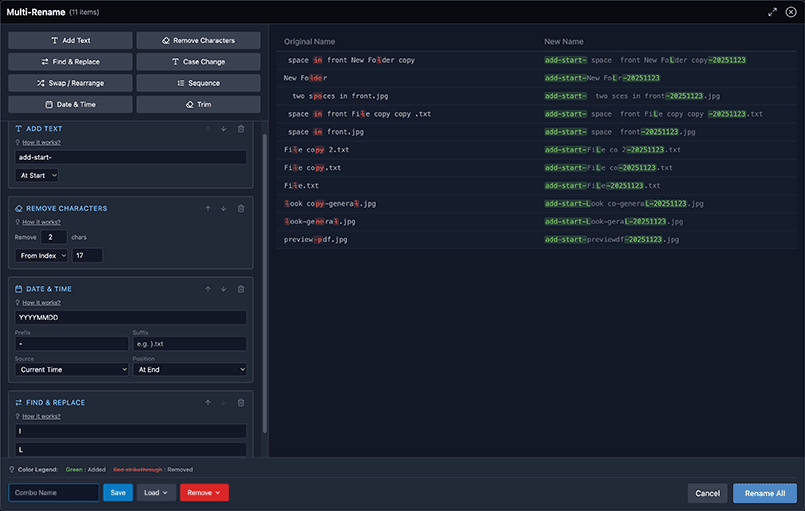
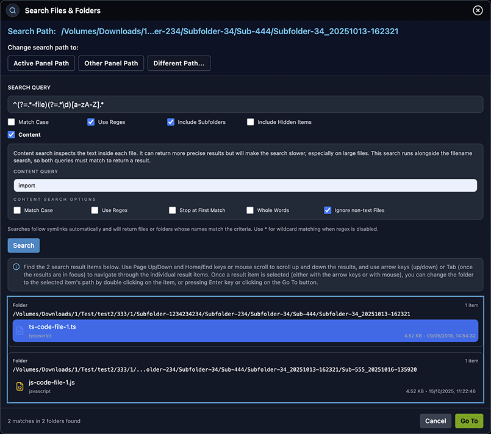

# Dual-Panel File Manager Monorepo + Electron app [ACTIVE WORK IN PROGRESS]

A compact developer & user guide for the app — use the Table of Contents
below to jump to details or scroll through the features and dev notes.

> ❗️ **Safety note — please back up important files**
>
> This project is a file manager and performs file operations (copy, move, delete,
> compress, etc.). Every effort has been made to make operations safe — confirmations,
> conflict handling and progress dialogs are included — but no tool can remove all
> risk. We strongly recommend you keep backups of important data before running bulk
> operations or destructive actions. Use the app responsibly and at your own risk.


## Table of Contents

- [General Look and Feel](#general-look-and-feel)
- [General Project Structure](#general-project-structure)
- [Prerequisites](#prerequisites)
- [Getting Started](#getting-started)
- [How It Works](#how-it-works)
- [Features](#features)
  - [Dual-Panel Layout](#dual-panel-layout)
  - [File and Folder Listing](#file-and-folder-listing)
  - [Column Sorting](#column-sorting)
  - [Panel Usage and Information](#panel-usage-and-information)
  - [Real-time Folder Monitoring](#real-time-folder-monitoring)
  - [Navigation and Selection](#navigation-and-selection)
    - [Selection Actions](#selection)
    - [Quick Select / Quick Unselect](#quick-select-quick-unselect)
    - [Quick Filter & Quick Filter by Type](#quick-filter)
  - [File Preview / Previewing Files](#file-preview)
  - [Calculate Folder Size](#calculate-folder-size)
  - [Favourites](#favourites)
  - [Operations via Console](#operations-via-console)
  - [Context Menus](#context-menus)
  - [Progress Modals](#progress-modals)
  - [Path Bar & Breadcrumbs](#path-bar-and-breadcrumbs)
  - [Top Menus](#top-menus)
  - [Function Key Actions](#function-key-actions)
  - [Copy/Move Operation and Conflict Modes](#copymove-operation-and-conflict-modes)
  - [Archive / Zip Operations](#archive-zip-operations)
  - [Rename & Multi Rename](#rename-and-multi-rename)
  - [Terminal](#terminal)
  - [Search](#search)
- [Electron Desktop Application](#electron-desktop-application)

---

## General Look and Feel

This is a dual-panel file manager designed for efficient file operations. The two independent panels allow you to browse two different locations simultaneously, making it easy to move, copy, and compare files and folders between them.

This project is inspired by applications like Midnight Commander and Double Commander, built with a React frontend and a Node.js (Express) backend. The project is structured as a monorepo using npm workspaces.


[<div style="text-align: right;"><small>Back to Table of Contents</small></div>](#table-of-contents)

## General Project Structure

```

/                                    # Project root directory
├── packages/                        # Contains the client, server, and electron applications
│   ├── client/                      # React frontend application
│   │   ├── icons/                   # Icons used by the application
│   │   ├── screenshots/             # Screnshots used by README.md and Help Modal
│   │   ├── src/                     # Source code for the React application
│   │   │   ├── components/          # Reusable UI components
│   │   │   │   ├── context-menus/   # Components for context menus
│   │   │   │   ├── help-diagrams/   # Components for help diagrams
│   │   │   │   ├── modals/          # Components for modal dialogs
│   │   │   │   ├── panels/          # Components for file panels
│   │   │   │   └── ui/              # General UI components
│   │   │   ├── lib/                 # Utility functions and API clients
│   │   │   ├── state/               # State management for the application
│   │   │   ├── App.jsx              # Main application component
│   │   │   ├── index.css            # Main CSS file
│   │   │   └── main.jsx             # Entry point for the React application
│   │   ├── index.html               # Main HTML file
│   │   ├── postcss.config.js        # PostCSS configuration
│   │   ├── tailwind.config.js       # Tailwind CSS configuration
│   │   └── vite.config.js           # Vite build configuration
│   ├── server/                      # Node.js backend application
│   │   ├── lib/                     # Utility functions and server-side logic
│   │   ├── routes/                  # API route definitions
│   │   └── server.js                # Entry point for the Node.js server
│   └── electron/                    # Electron desktop application
│       ├── src/                     # Electron main process (dynamic imports only)
│       │   ├── main.js              # Main process with runtime module resolution
│       │   └── preload.js           # Security preload script
│       ├── build.js                 # Build assembly script
│       └── package.json             # Electron and electron-builder config
├── misc/                            # Miscellaneous scripts and tools
│   ├── create-corrupt-zip.js        # Utility for creating corrupt archives for testing
│   ├── fm.js                        # Developer console helpers (entry point for FM dev console helpers)
│   ├── fm/                          # Modular FM developer console helpers
│   │   ├── attach.js                # Attaches the FM object to global/window (interactive console usage)
│   │   ├── help.js                  # Generates and displays FM.help() documentation (uses metadata)
│   │   ├── methods.js               # Implementation of FM.* helper methods (navigation, selection, etc.)
│   │   ├── properties.js            # Read-only FM properties and metadata attachment
│   │   ├── utils.js                 # Internal helpers used by FM (detectBuildType, getAppState, etc.)
│   │   └── meta.json                # Metadata for FM methods and properties (used by help.js and properties.js)
│   │── prebuild-node-pty.js         # Helper to prepare the optional native node-pty addon (build/venv helpers)
│   │── prepare-node-pty.js          # Runtime prepare helper (copies/rebuilds cached node-pty for server/electron)
│   │── patch-node-pty-helperpath.js # Idempotent patcher to fix node-pty helper paths in vendor copies
│   │── instrument-node-pty.js       # On-demand instrumentation for native posix_spawn/pty diagnostics
│   ├── starter.js                   # Interactive starter menu (used by postinstall and start scripts)
│   └── README.md                    # Documentation for miscellaneous scripts (see misc/README.md)
├── start.sh                         # Start script for macOS and Linux
├── start.bat                        # Start script for Windows (Command Prompt)
├── start.ps1                        # Start script for Windows (PowerShell)
└── README.md                        # Main project README

```


[<div style="text-align: right;"><small>Back to Table of Contents</small></div>](#table-of-contents)

## Prerequisites

- **Node.js** (v20.19.0 or later recommended)

- **npm** (v10.8.2 or later recommended)

- **FFmpeg**: This is required for the video preview transcoding feature. It must be installed and accessible in your system's PATH.
  - **macOS (with Homebrew):** `brew install ffmpeg`
  - **Ubuntu/Debian:** `sudo apt install ffmpeg`
  - **Windows:** Download from the [official FFmpeg website](https://ffmpeg.org/download.html) and add the `bin` directory to your system's PATH.


[<div style="text-align: right;"><small>Back to Table of Contents</small></div>](#table-of-contents)

## Getting Started

1. Install dependencies

    Run this from the repository root:

    ```bash
    npm install
    ```

2. About the optional native addon (node-pty)

    The server package optionally uses `node-pty` for an improved in-app terminal. If a matching native binary isn't available, the server falls back to a pipe-based terminal that still works but may lack some features.

    There are included helpers (`misc/prebuild-node-pty.js`) and (`misc/patch-node-pty-helperpath.js`) that assist on fresh clones and the `postinstall` runs during `npm install` and will try to prepare `node-pty` locally when needed. It is conservative and never fails `npm install`.

3. Starter & startup

   An interactive starter (`misc/starter.js`) provides a short menu for common developer tasks (start Node app, run Electron dev, build dists). If needed, for testing and debugging, one can use special environment variables -

   - `STARTER_AUTO_SELECT` — When set to a non-empty number, `starter` auto-selects that menu option and runs it. This is useful for automated runs (e.g. `STARTER_AUTO_SELECT=3 ./start.sh` will auto-select the "Build Electron (macOS)" option). 

      Example:

      ```bash
      # Auto-run option 3 (Build Electron (macOS)) and pick the same shell environment as your interactive shell
      STARTER_AUTO_SELECT=3 STARTER_DEBUG=1 ./start.sh
      ```

    - `STARTER_DEBUG` — Enables extra diagnostics printed by the starter about the shell environment it will use to run commands. This prints the effective `SHELL`, `PATH` and runs a few basic checks (`node -v`, `npm -v`, `which npm`, `which hdiutil`). Use it to debug environment or PATH issues when packaging or building via the starter. 
    
      Example:

        ```bash
        STARTER_DEBUG=1 ./start.sh
        ```

4. Run the application

- Web (development): `npm run dev` — starts the server and the React dev server (concurrently).
- Electron (development): `npm run electron:dev` — builds the client and launches Electron with the bundled server.
- Start scripts: `./start.sh`, `start.bat`, or `start.ps1` perform basic environment checks and then run the starter menu.

  These helpers are conservative and opt-out-friendly — they aim to make fresh-clone setup faster while avoiding risky global changes.
  You may need to change the execution policy to run the script.


[<div style="text-align: right;"><small>Back to Table of Contents</small></div>](#table-of-contents)

## How It Works

The React client makes API calls to the Node.js server to get directory listings.

The Node.js server interacts with the local file system to provide the data requested by the client.

A proxy is configured in the Vite settings (packages/client/vite.config.js) to forward requests from /api on the client to the backend server on port 3001. This avoids CORS issues during development.

When running the Electron app, both client and server and the node binaries and dependancies are all bundled in the app.


[<div style="text-align: right;"><small>Back to Table of Contents</small></div>](#table-of-contents)

## Features


### Dual-Panel Layout
A dual-panel file manager designed for efficient file operations. The two independent panels allow you to browse two different locations simultaneously, making it easy to move, copy, and compare files and folders between them.


### File and Folder Listing
Each panel lists files and folders. Long names are dynamically truncated. Icons next to each name (folder icon for folders, text file icon for text files, image icon for images, etc.) help identify the type.

  
  


### Column Sorting
You can sort the list by clicking on the column headers (Name, Size, Modified). Clicking the same column cycles through ascending (up arrow) and descending (down arrow) order. The selected files will remain selected even after sorting.


### Panel Usage and Information
At the bottom of each panel, useful information is displayed. This includes the total disk space and available free space for the current drive/partition, a summary of selected items, and the ability to swap panels. The free space percentage is color-coded to provide a quick visual cue: 🟢 green for more than 25% free, 🟡 yellow for 10-25% free, and 🔴 red for less than 10% free. Hovering over the selected items text reveals a tooltip with a detailed breakdown of selected files and folders, their combined size, and a hint on how to calculate full folder sizes if applicable. You can quickly swap the content of the two panels using <kbd>Cmd/Ctrl + U</kbd>.

  


### Real-time Folder Monitoring
The application automatically monitors the directories shown in both panels for any changes made outside of the app. If you create, delete, or rename a file or folder in one of the visible directories using another program (like your operating system's file explorer), the panel will automatically refresh to reflect these changes in real-time.


### Navigation and Selection
Navigate using mouse (double-click to enter folder/open file) or keyboard (<kbd>ArrowUp</kbd>/<kbd>Down</kbd>, <kbd>Enter</kbd>, <kbd>Backspace</kbd>, <kbd>Home</kbd>, <kbd>End</kbd>, <kbd>PageUp</kbd>/<kbd>PageDown</kbd>). Use the ".." entry to go up to the parent directory.

  

#### Selection
  Click an item to select it. <kbd>Cmd/Ctrl + click</kbd> to add/remove. <kbd>Shift + click</kbd> to select a range.

    

  - **Select All** (<kbd>Cmd/Ctrl+A</kbd>)

  - **Unselect All** (<kbd>Cmd/Ctrl+D</kbd>)

  - **Invert Selection** (<kbd>\*</kbd>)

#### Quick Select / Quick Unselect
  Quick Select (<kbd>+</kbd>): Opens a dialog to select files and folders that match a specific pattern (wildcards or regex).

  Quick Unselect (<kbd>-</kbd>): Opens a dialog to unselect items based on a pattern.

  - **Select/Unselect by Type**: The application supports selecting or unselecting by type from the `Select & Filter` menu or from the Additional Commands submenu in any context menu:
    - **Select Files only** — selects only file items in the panel (menu label: `Select Files only`).
    - **Select Folders only** — selects only folder items in the panel (menu label: `Select Folders only`).
    - **Select Zip Files only** — selects only zip items in the panel (menu label: `Select Zip Files only`).
    - **Unselect Files only** — unselects file items in the panel (menu label: `Unselect Files only`).
    - **Unselect Folders only** — unselects folder items in the panel (menu label: `Unselect Folders only`).
    - **Unselect Zip Files only** — unselects zip items in the panel (menu label: `Unselect Zip Files only`).

#### Quick Filter
  Quick Filter (<kbd>.</kbd>): Opens an input at the bottom of the panel to filter visible items in real-time. File operations like Copy, Copy Path, Calculate folder size, Archive operations and Delete will only apply to the filtered items.

  - **Quick Filter by Type**: In addition to a general quick filter (pattern), the app provides quick filters for specific types (available from `Select & Filter` and context menus):
    - **Quick Filter Files only** — filters the panel to show only files (menu label: `Quick Filter Files only`).
    - **Quick Filter Folders only** — filters the panel to show only folders (menu label: `Quick Filter Folders only`).
    - **Quick Filter Zip Files only** — filters the panel to show only zip files (menu label: `Quick Filter Zip Files only`).
    - **Reset Quick Filter** — clears any quick filter applied to the panel (menu label: `Reset Quick Filter`).

    


### File Preview
Preview images, videos, PDFs, text files, and zip archives by focusing an item and pressing <kbd>Spacebar</kbd>. Supported formats include:

  - **Images:** JPG, PNG, GIF, BMP, TIFF, WebP
  - **Documents:** PDF
  - **Video:** MP4, WebM, Ogg, MOV, MKV
  - **Audio:** MP3, M4A, AAC, FLAC, WAV, Ogg, WMA
  - **Text & Code:** A wide variety of text and code files are supported, including Text (`txt`), Markdown (`md`), JavaScript (`js`, `jsx`), TypeScript (`ts`, `tsx`), JSON (`json`), CSS (`css`), HTML (`html`), YAML (`yml`, `yaml`), Python (`py`), Shell Scripts (`sh`), XML (`xml`), and more.
  - **Archives:** ZIP


### Rename and Multi Rename

The rename functionality adapts based on the number of selected items. For a single item, you can rename it directly in the panel by pressing <kbd>F2</kbd> or selecting "Rename" from the context menu. When multiple items are selected, the application offers the Multi Rename modal with a set of targeted rename tools and a live preview so you can compose safe, multi-step rename operations before applying them.

  The Multi Rename modal contains a variety of tools for transforming file and folder names. Each tool includes helpful options and previews so you can apply complex renames safely. The available operations include:

  - **Add Text** — Insert text at the start, end, or a specific position in names.
  - **Remove Characters** — Delete a specific number of characters from names.
  - **Find & Replace** — Find and replace text or patterns in names.
  - **Case Change** — Change the case of names (uppercase, lowercase, title case, etc.).
  - **Swap / Rearrange** — Swap or rearrange parts of names separated by a delimiter.
  - **Sequence** — Add sequential numbers to names (custom start/step/format available).
  - **Date & Time** — Add the current date/time or file modification date/time to names using configurable formats.
  - **Trim** — Remove whitespace from the start, end, or both sides of names.

  Each operation runs against a live preview so you can safely experiment and build multi-step rename chains before applying them to your files.


  


### Terminal

You can open a built-in terminal directly within the application, either in the current panel's path or in the other panel's path. This allows you to execute shell commands without leaving the file manager.

  - **Clear Terminal**: Clears the current terminal screen.
  - **Clear Scrollback**: Clears the terminal's scrollback history.

  


### Search

Launches a modal from the top `Commands` menu or the Additional Commands submenu of any context menu to search either panel. The dialog starts in the active panel but lets you switch to the other panel's path or pick any folder without closing the modal.

  The modal searches by name (wildcards/regex supported) through subfolders and can include hidden items when requested. Enabling **content search** lets you search inside files with options for match case, regex patterns, whole-word matches, ignoring non-text files, and stopping at the first matching file for faster results.

  


### Operations via Console
This project exposes a small, developer-friendly global named `FM` in the page context (via `window.FM`) to make debugging and interactive exploration easier when running in dev or Electron contexts. Once the app is loaded, open your browser's developer console and run `FM.help()` to see a complete list of all available methods with their descriptions.

  The `FM` global provides convenient methods for programmatically navigating panels, inspecting application state, triggering operations, and automating tasks during development.

  **Examples:**
  - `FM.getActivePanel()` — get active panel's side, path, and selection
  - `await FM.setActivePanelPath('/path/to/folder')` — navigate active panel to a specific directory
  - `FM.setActivePanelSelection(['file1.txt', 'Documents', '/absolute/path/file2.txt'], true, false)` — select files, folders, and absolute paths with case-insensitive matching, adding to current selection
  - `FM.setActivePanelQuickSelect('*.jpg', false, false, true)` — select all JPG files in active panel using wildcard pattern
  - `FM.setOtherPanelQuickSelect('^[A-Z].*\\.txt$', true, false, true)` — select all TXT files starting with uppercase letter in other panel using regex
  - `FM.setActivePanelQuickFilterFiles()` — filter the active panel to show only files
  - `FM.toggleActivePanelSide()` — toggle between left and right panels
  - `FM.refreshBothPanels()` — reload directory contents for both panels
  - `FM.swapPanels()` — swap the directory paths of left and right panels
  - `await FM.compressToOtherPanel(['*.jpg','file.txt'])` — compress selected items (or, if nothing is selected, apply the provided patterns against all items in the source panel) into a ZIP archive placed in the other panel. Patterns may be exact names, shell-style wildcards (e.g. '*.jpg'), or regex strings (e.g. '/^IMG_\\d+\\.JPG$/i'). Returns an error if no items match.
  - `await FM.copyToActivePanel(['a.txt','b/c.jpg'], 'if_newer')` — copy selected items from the source panel into the active panel. If there is no selection in the source panel and you supply item patterns, they will be applied across the panel. The optional overwrite parameter accepts boolean or canonical tokens (for example 'if_newer') to control overwrite behavior and avoid interactive prompts.

    

    (See `misc/fm/meta.json` and `misc/fm/methods.js` for full parameter syntax and behavior.)


### Context Menus
Right-clicking on an item or empty area opens a context menu with relevant actions.

  - **New _Submenu_**: You can create a new folder or a new empty text file directly from the application.

    - <kbd>New Folder</kbd> | <kbd>F7</kbd>: A new folder will be created with a default name, ready for you to rename.

    - <kbd>New File</kbd>: This will create a new, empty text file (`.txt`) with a default name. The filename will be selected up to the extension, so you can start typing the name right away.

  - **Viewing:** Preview, Open, and Open with...

  - **File Operations:** Contains all major file transfer actions, grouped under the "**Copy & Move**" submenu, and the "**Archive**" submenu.

    - **Copy & Move _Submenu_:**

      - <kbd>Copy to other panel</kbd> | <kbd>F5</kbd>: Performs the Copy operation on the selected item(s) to the **inactive** panel.
      - <kbd>Copy to clipboard</kbd> | <kbd>Cmd/Ctrl+C</kbd>: Copies the currently selected items to clipboard, allowing a follow up operation - Paste from clipboard. After Paste is complete the original copied items would still be persisted.
      - <kbd>Copy to...</kbd>: Opens a modal to select a specific destination directory for the copy operation.

      - **Copy Paths _Submenu_:** Contains options to copy absolute or relative paths of selected items (including or excluding subfolder items) to the OS clipboard, or to download them as a text file.

        - **Copy Paths to Clipboard**: Copies absolute or relative paths of selected items (including or excluding subfolder items) to the OS clipboard.
        - **Copy Paths and Download**: Downloads a text file containing absolute or relative paths of selected items (including or excluding subfolder items).

      - <kbd>Move to other panel</kbd>| <kbd>F6</kbd>: Performs the Move operation on the selected item(s) to the **inactive** panel.
      - <kbd>Move (Cut) to clipboard</kbd>| <kbd>Cmd/Ctrl+X</kbd>: Copies (with the intention for Cut/Move) the currently selected items to clipboard, allowing a follow up operation - Paste from clipboard. After Paste is complete the original copied items would be deleted.
      - <kbd>Move to...</kbd>: Opens a modal to select a specific destination directory for the move operation.
      - <kbd>Paste from clipboard</kbd> | <kbd>Cmd/Ctrl+V</kbd>: Pastes the currently copied (or cut) items from the app clipboard, and into the active panel (path). Feel free to change paths and active panels after you did a Copy/Cut, thus allowing you to paste your items in a completly different place and at your convinience (time wise). If the operation previously selected was Move (Cut), then upon successful copying of the items, the source items would be deleted. If it was Copy, then the original items would persist at their location.

    - **Archive _Submenu_:** See [Archive / Zip Operations](#archive-zip-operations).

  - **Organization:** Rename and Delete the item.
  - **Folder Tools:** For folders, you can also Calculate Size or set the folder's path in the opposite panel.

    - **Additional Commands:** The bottom-most section in every context menu (item and empty area) holds the Additional Commands submenu. It begins with Search actions for both panels and continues with grouped utility actions like Copy Paths, Terminal, Refresh panels and Swap panels.

    


### Archive / Zip Operations

  - <kbd>Compress</kbd>: Compresses the selected items into a zip archive in the active panel or transfers it to the other panel.
  - <kbd>Decompress</kbd>: Decompress one or more selected ZIP archives into the active or other panel. You can extract files directly into the destination folder or choose to extract each archive into its own archive-named subfolder (with automatic collision suffixing). A progress dialog displays extraction progress and handles overwrite prompts.
  - <kbd>Test Archive</kbd>: Verifies the integrity of a selected ZIP archive, including multiple selected ZIP archives, reporting any corrupt files or general issues.


### Calculate Folder Size
Calculate the size of a folder (including all its subfolders and and files) from the context menu or by pressing <kbd>Spacebar</kbd> on a focused folder. A progress modal shows the current file being processed, the "Size so far", and the instantaneous transfer speed.

  


### Progress Modals
During any long-running operation (like calculating folder size, copying, compressing, decompressing, testing archives, or gathering paths), a progress dialog will appear, often displaying the instantaneous speed of transfer. If you need to see the panels behind the dialog, you can click and hold on the animated icon (e.g., spinning circle or pulsing search icon) in the dialog's header. This will make the dialog semi-transparent (20% opacity). Releasing the mouse button will restore its full visibility.

  


### Path Bar and Breadcrumbs
Displays the current directory path with clickable "breadcrumbs" for easy navigation. Right-clicking the path bar offers a "Select a folder..." option, which opens a folder selection dialog.

  


### Favourites
The star icon next to the path bar allows you to manage your favourite paths. Add the current path or select a previously saved favourite path. Favourites are remembered across sessions. There is also a submenu there with recently visited paths, these are session based.

  


### Top Menus
"File", "Select & Filter", and "Commands" menu provide access to comprehensive file management, selection, filter and addtional tools including searching for files and folders.  

  


### File Menu
Contains actions related to file operations such as **New (in a submenu)**, **Copy & Move (in a submenu)**, Rename, Delete, Compress, Calculate Size, and Refresh. Many of these actions have corresponding function key shortcuts.


### Select and Filter Menu
Offers various ways to manage selections, including Select All, Unselect All, Invert Selection, Quick Select, Quick Unselect, and Quick Filter.


### Commands Menu
Contains Search, Copy Paths to Clipboard, Copy Paths and Download, Terminal, Refresh and Swap panels.


### Function Key Actions

  The bar at the bottom of the screen shows primary actions mapped to F1-F8 keys for common operations.

  - <kbd>F1</kbd>: Open Help dialog.

  - <kbd>F2</kbd>: Rename the currently selected item(s). For multi-rename see [Rename & Multi Rename](#rename-and-multi-rename)

  - <kbd>F3 (View)</kbd>: Previews a file if it's a supported format (image, video, PDF, text, archive); otherwise, it opens the file with the default system application. This key does nothing for folders.

  - <kbd>Spacebar (Preview)</kbd>: Previews a file if it's a supported format. For folders, this key calculates the folder's total size.

  - <kbd>F4</kbd>: Edit the focused text/code file is possible - this opens an editor with undo/redo, find/replace, and save functionality - otherwise open it with its default application.

  - <kbd>F5</kbd>: Copy selected items from the active panel to the other panel.

  - <kbd>F6</kbd>: Move selected items from the active panel to the other panel.

  - <kbd>F7</kbd>: Create a new folder in the active panel.

  - <kbd>F8</kbd>: Delete the selected items.

  - <kbd>F9</kbd>: Open a terminal in the current panel's path.

  - <kbd>F10</kbd>:  Exit the application cleanly (closes all running jobs and terminates the app).

    


### Copy/Move Operation and Conflict Modes
When copying/moving, if an item exists in the target, a confirmation dialog appears with choices for handling conflicts (e.g., "Yes to All", "Copy/Move if New", "No to All", "Skip if Source is Empty", "Overwrite if Size Differs", "Replace if Smaller").

  


[<div style="text-align: right;"><small>Back to Table of Contents</small></div>](#table-of-contents)

## Electron Desktop Application

The project includes a desktop application built with Electron that bundles the React frontend and Node.js backend into a standalone app for macOS, Windows, and Linux.


### Electron Features

- **Self-Contained**: No external Node.js installation required
- **Zero-Duplication Architecture**: Electron uses dynamic imports from workspace packages
- **Multi-Platform**: Builds available for macOS (DMG/ZIP), Windows (NSIS/ZIP), and Linux (AppImage/deb/tar.gz)
- **All Features Included**: Full file management capabilities in a desktop app


### Electron Quick Commands

**Development:**

```bash
npm run electron:dev
```

**Build Distribution:**

```bash
npm run electron:dist:mac      # macOS DMG and ZIP
npm run electron:dist:win      # Windows NSIS installer and ZIP
npm run electron:dist:linux    # Linux AppImage, deb, and tar.gz
npm run electron:dist:all      # All platforms
```

The result Electron apps would be output in the following folder:

```
packages/electron/dist
```


[<div style="text-align: right;"><small>Back to Table of Contents</small></div>](#table-of-contents)

