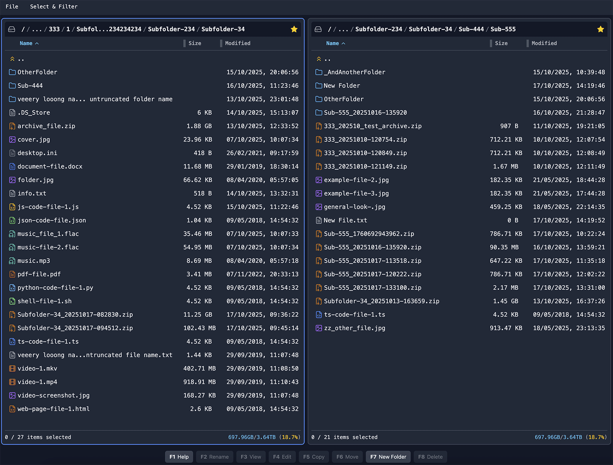
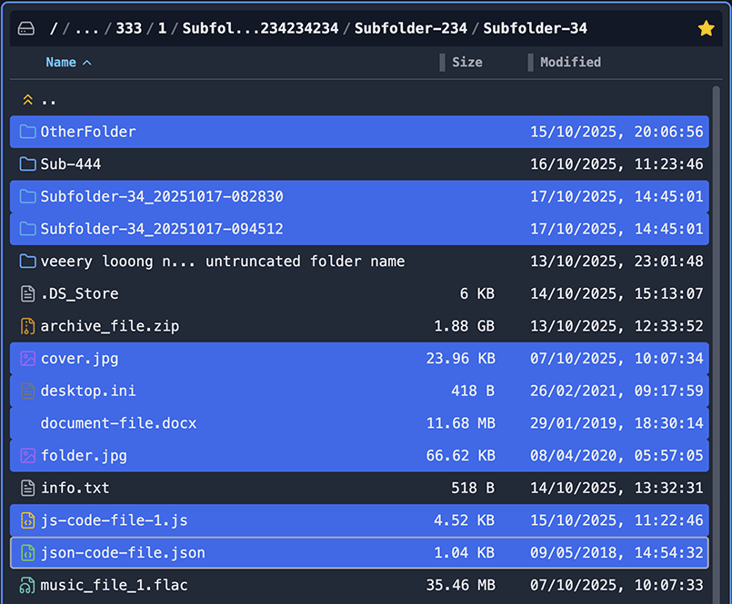
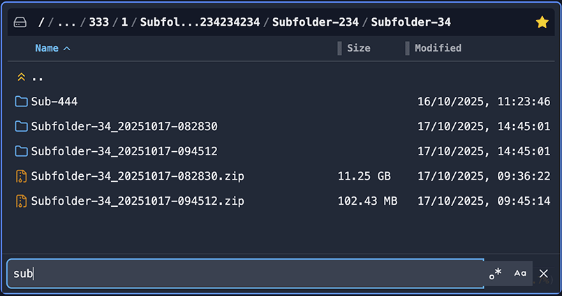
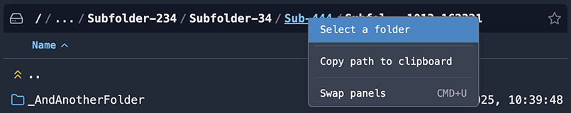
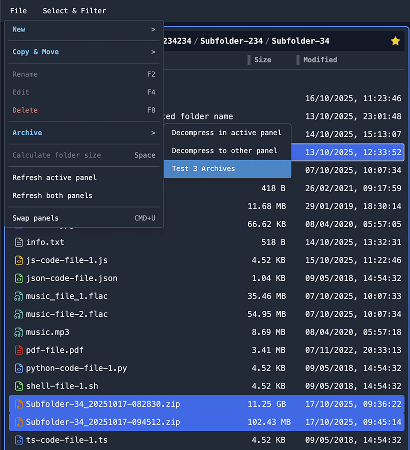
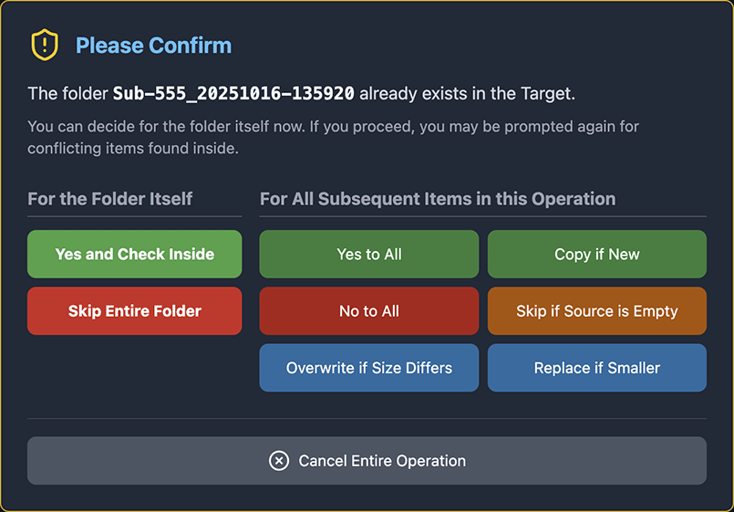

# Dual-Panel File Manager Monorepo [ACTIVE WORK IN PROGRESS - DO NOT USE YET]

This is a dual-panel file manager designed for efficient file operations. The two independent panels allow you to browse two different locations simultaneously, making it easy to move, copy, and compare files and folders between them.

This project is inspired by applications like Midnight Commander and Double Commander, built with a React frontend and a Node.js (Express) backend. The project is structured as a monorepo using npm workspaces.

## General Look and Feel



## General Project Structure

```

/                                    # Project root directory
├── packages/                        # Contains the client, server, and electron applications
│   ├── client/                      # React frontend application
│   │   ├── icons/                   # Icons used by the application
│   │   ├── screenshots/             # Screnshots used by README.md and Help Modal
│   │   ├── src/                     # Source code for the React application
│   │   │   ├── components/          # Reusable UI components
│   │   │   │   ├── context-menus/   # Components for context menus
│   │   │   │   ├── help-diagrams/   # Components for help diagrams
│   │   │   │   ├── modals/          # Components for modal dialogs
│   │   │   │   ├── panels/          # Components for file panels
│   │   │   │   └── ui/              # General UI components
│   │   │   ├── lib/                 # Utility functions and API clients
│   │   │   ├── state/               # State management for the application
│   │   │   ├── App.jsx              # Main application component
│   │   │   ├── index.css            # Main CSS file
│   │   │   └── main.jsx             # Entry point for the React application
│   │   ├── index.html               # Main HTML file
│   │   ├── postcss.config.js        # PostCSS configuration
│   │   ├── tailwind.config.js       # Tailwind CSS configuration
│   │   └── vite.config.js           # Vite build configuration
│   ├── server/                      # Node.js backend application
│   │   ├── lib/                     # Utility functions and server-side logic
│   │   ├── routes/                  # API route definitions
│   │   └── server.js                # Entry point for the Node.js server
│   └── electron/                    # Electron desktop application
│       ├── src/                     # Electron main process (dynamic imports only)
│       │   ├── main.js              # Main process with runtime module resolution
│       │   └── preload.js           # Security preload script
│       ├── build.js                 # Build assembly script
│       └── package.json             # Electron and electron-builder config
├── misc/                            # Miscellaneous scripts and tools
│   ├── create-corrupt-zip.js        # Utility for creating corrupt archives for testing
│   ├── prebuild-node-pty.js         # Helper to prepare the optional native node-pty addon
│   ├── prepare-node-pty.js          # Runtime prepare helper (copies/rebuilds cached node-pty for server/electron)
│   ├── starter.js                   # Interactive starter menu (used by postinstall and start scripts)
│   └── README.md                    # Documentation for miscellaneous scripts
├── start.sh                         # Start script for macOS and Linux
├── start.bat                        # Start script for Windows (Command Prompt)
├── start.ps1                        # Start script for Windows (PowerShell)
└── README.md                        # Main project README

```

## Prerequisites

- **Node.js** (v20.19.0 or later recommended)

- **npm** (v10.8.2 or later recommended)

- **FFmpeg**: This is required for the video preview transcoding feature. It must be installed and accessible in your system's PATH.
  - **macOS (with Homebrew):** `brew install ffmpeg`
  - **Ubuntu/Debian:** `sudo apt install ffmpeg`
  - **Windows:** Download from the [official FFmpeg website](https://ffmpeg.org/download.html) and add the `bin` directory to your system's PATH.

## Getting Started

1. Install dependencies

Run this from the repository root:

```bash
npm install
```

2. About the optional native addon (node-pty)

The server package optionally uses `node-pty` for an improved in-app terminal. If a matching native binary isn't available, the server falls back to a pipe-based terminal that still works but may lack some features.

There is an included helper (`misc/prebuild-node-pty.js`) and a best-effort `postinstall` runner that assist on fresh clones:

- The `postinstall` runs during `npm install` and will try to prepare `node-pty` locally when needed. It is conservative and never fails `npm install`.
- When verification succeeds the helper writes a fast-skip marker at `packages/server/.node-pty-ready.json`. Subsequent `npm install` runs check that marker and skip the heavy steps if Node and native ABI haven't changed. The marker is git-ignored.
- Force a re-check or re-run of the helper:

```bash
rm -f packages/server/.node-pty-ready.json
node ./misc/prebuild-node-pty.js --apply-fixes --yes --auto-env
```

## Developer notes

There are two helpers related to `node-pty` in this repository:

- `misc/prebuild-node-pty.js` — an install-time, interactive/heavy helper that attempts to configure a build environment (creates a repo-local venv, adds a distutils shim if needed, and performs package installs). Use this when preparing a fresh clone or when `npm install` can't build the native addon automatically.
- `misc/prepare-node-pty.js` — a lightweight runtime helper used by the server (and the Electron build flow). It prefers cached ABI-matching binaries under `.node-pty-cache` and only falls back to rebuilding (using `npm rebuild` or `electron-rebuild`) when necessary.

Force a rebuild / clear cache (developer helper)

Run these from the repository root to clear cached binaries and re-run the runtime prepare helper:

```bash
rm -rf .node-pty-cache
node ./misc/prepare-node-pty.js
```

3. Starter & startup

An interactive starter (`misc/starter.js`) provides a short menu for common developer tasks (start Node app, run Electron dev, build dists).

4. Run the application

- Web (development): `npm run dev` — starts the server and the React dev server (concurrently).
- Electron (development): `npm run electron:dev` — builds the client and launches Electron with the bundled server.
- Start scripts: `./start.sh`, `start.bat`, or `start.ps1` perform basic environment checks and then run the starter menu.

These helpers are conservative and opt-out-friendly — they aim to make fresh-clone setup faster while avoiding risky global changes.
You may need to change the execution policy to run the script.

## How It Works

The React client makes API calls to the Node.js server to get directory listings.

The Node.js server interacts with the local file system to provide the data requested by the client.

A proxy is configured in the Vite settings (packages/client/vite.config.js) to forward requests from /api on the client to the backend server on port 3001. This avoids CORS issues during development.

When running the Electron app, both client and server and the node binaries and dependancies are all bundled in the app.

## Features

- **Dual-Panel Layout**: A dual-panel file manager designed for efficient file operations. The two independent panels allow you to browse two different locations simultaneously, making it easy to move, copy, and compare files and folders between them.

- **File & Folder Listing**: Each panel lists files and folders. Long names are dynamically truncated. Icons next to each name (folder icon for folders, text file icon for text files, image icon for images, etc.) help identify the type.

  - **Column Sorting:** You can sort the list by clicking on the column headers (Name, Size, Modified). Clicking the same column cycles through ascending (up arrow) and descending (down arrow) order. The selected files will remain selected even after sorting.

  
  

- **Panel Usage and Information**: At the bottom of each panel, useful information is displayed. This includes the total disk space and available free space for the current drive/partition, a summary of selected items, and the ability to swap panels. The free space percentage is color-coded to provide a quick visual cue: 🟢 green for more than 25% free, 🟡 yellow for 10-25% free, and 🔴 red for less than 10% free. Hovering over the selected items text reveals a tooltip with a detailed breakdown of selected files and folders, their combined size, and a hint on how to calculate full folder sizes if applicable. You can quickly swap the content of the two panels using <kbd>Cmd/Ctrl + U</kbd>.

  

- **Real-time Folder Monitoring**: The application automatically monitors the directories shown in both panels for any changes made outside of the app. If you create, delete, or rename a file or folder in one of the visible directories using another program (like your operating system's file explorer), the panel will automatically refresh to reflect these changes in real-time.

- **Navigation & Selection**: Navigate using mouse (double-click to enter folder/open file) or keyboard (<kbd>ArrowUp</kbd>/<kbd>Down</kbd>, <kbd>Enter</kbd>, <kbd>Backspace</kbd>, <kbd>Home</kbd>, <kbd>End</kbd>, <kbd>PageUp</kbd>/<kbd>PageDown</kbd>). Use the ".." entry to go up to the parent directory.

  

  - **Selection**: Click an item to select it. <kbd>Cmd/Ctrl + click</kbd> to add/remove. <kbd>Shift + click</kbd> to select a range.

    

  - **Select All** (<kbd>Cmd/Ctrl+A</kbd>)

  - **Unselect All** (<kbd>Cmd/Ctrl+D</kbd>)

  - **Invert Selection** (<kbd>\*</kbd>)

  - **Quick Select** (<kbd>+</kbd>): Opens a dialog to select files and folders that match a specific pattern (wildcards or regex).

  - **Quick Unselect** (<kbd>-</kbd>): Opens a dialog to unselect items based on a pattern.

  - **Quick Filter** (<kbd>.</kbd>): Opens an input at the bottom of the panel to filter visible items in real-time. File operations like Copy, Copy Path, Calculate folder size, Archive operations and Delete will only apply to the filtered items.

    

- **File Preview**: Preview images, videos, PDFs, text files, and zip archives by focusing an item and pressing <kbd>Spacebar</kbd>. Supported formats include:

  - **Images:** JPG, PNG, GIF, BMP, TIFF, WebP
  - **Documents:** PDF
  - **Video:** MP4, WebM, Ogg, MOV, MKV
  - **Audio:** MP3, M4A, AAC, FLAC, WAV, Ogg, WMA
  - **Text & Code:** A wide variety of text and code files are supported, including Text (`txt`), Markdown (`md`), JavaScript (`js`, `jsx`), TypeScript (`ts`, `tsx`), JSON (`json`), CSS (`css`), HTML (`html`), YAML (`yml`, `yaml`), Python (`py`), Shell Scripts (`sh`), XML (`xml`), and more.
  - **Archives:** ZIP

- **Terminal**: You can open a built-in terminal directly within the application, either in the current panel\'s path or in the other panel\'s path. This allows you to execute shell commands without leaving the file manager.

  - **Clear Terminal**: Clears the current terminal screen.
  - **Clear Scrollback**: Clears the terminal\'s scrollback history.

  

- **Context Menus**: Right-clicking on an item or empty area opens a context menu with relevant actions.

  - **New _Submenu_**: You can create a new folder or a new empty text file directly from the application.

    - <kbd>New Folder</kbd> | <kbd>F7</kbd>: A new folder will be created with a default name, ready for you to rename.

    - <kbd>New File</kbd>: This will create a new, empty text file (`.txt`) with a default name. The filename will be selected up to the extension, so you can start typing the name right away.

  - **Viewing:** Preview, Open, and Open with...

  - **File Operations:** Contains all major file transfer actions, grouped under the "**Copy & Move**" submenu, and the "**Archive**" submenu.

    - **Copy & Move _Submenu_:**

      - <kbd>Copy to other panel</kbd> | <kbd>F5</kbd>: Performs the Copy operation on the selected item(s) to the **inactive** panel.
      - <kbd>Copy to clipboard</kbd> | <kbd>Cmd/Ctrl+C</kbd>: Copies the currently selected items to clipboard, allowing a follow up operation - Paste from clipboard. After Paste is complete the original copied items would still be persisted.
      - <kbd>Copy to...</kbd>: Opens a modal to select a specific destination directory for the copy operation.

      - **Copy Paths _Submenu_:** Contains options to copy absolute or relative paths of selected items (including or excluding subfolder items) to the OS clipboard, or to download them as a text file.

        - **Copy Paths to Clipboard**: Copies absolute or relative paths of selected items (including or excluding subfolder items) to the OS clipboard.
        - **Copy Paths and Download**: Downloads a text file containing absolute or relative paths of selected items (including or excluding subfolder items).

      - <kbd>Move to other panel</kbd>| <kbd>F6</kbd>: Performs the Move operation on the selected item(s) to the **inactive** panel.
      - <kbd>Move (Cut) to clipboard</kbd>| <kbd>Cmd/Ctrl+X</kbd>: Copies (with the intention for Cut/Move) the currently selected items to clipboard, allowing a follow up operation - Paste from clipboard. After Paste is complete the original copied items would be deleted.
      - <kbd>Move to...</kbd>: Opens a modal to select a specific destination directory for the move operation.
      - <kbd>Paste from clipboard</kbd> | <kbd>Cmd/Ctrl+V</kbd>: Pastes the currently copied (or cut) items from the app clipboard, and into the active panel (path). Feel free to change paths and active panels after you did a Copy/Cut, thus allowing you to paste your items in a completly different place and at your convinience (time wise). If the operation previously selected was Move (Cut), then upon successful copying of the items, the source items would be deleted. If it was Copy, then the original items would persist at their location.

    - **Archive _Submenu_:**
      - <kbd>Compress</kbd>: Compresses the selected items into a zip archive in the active panel or transfers it to the other panel.
      - <kbd>Decompress</kbd>: Decompresses a selected ZIP archive to the active or other panel, with progress tracking.
      - <kbd>Test Archive</kbd>: Verifies the integrity of a selected ZIP archive, including multiple selected ZIP archives, reporting any corrupt files or general issues.

  - **Organization:** Rename and Delete the item.
  - **Folder Tools:** For folders, you can also Calculate Size or set the folder's path in the opposite panel.

    

- **Calculate Folder Size**: Calculate the size of a folder (including all its subfolders and and files) from the context menu or by pressing <kbd>Spacebar</kbd> on a focused folder. A progress modal shows the current file being processed, the "Size so far", and the instantaneous transfer speed.

  

- **Progress Modals**: During any long-running operation (like calculating folder size, copying, compressing, decompressing, testing archives, or gathering paths), a progress dialog will appear, often displaying the instantaneous speed of transfer. If you need to see the panels behind the dialog, you can click and hold on the animated icon (e.g., spinning circle or pulsing search icon) in the dialog's header. This will make the dialog semi-transparent (20% opacity). Releasing the mouse button will restore its full visibility.

  

- **Path Bar & Breadcrumbs**: Displays the current directory path with clickable "breadcrumbs" for easy navigation. Right-clicking the path bar offers a "Select a folder..." option, which opens a folder selection dialog.

  

- **Favourites**: The star icon next to the path bar allows you to manage your favourite paths. Add the current path or select a previously saved favourite path. Favourites are remembered across sessions. There is also a submenu there with recently visited paths, these are session based.

  

- **Top Menus**: "File" and "Select" menus provide access to comprehensive file management and selection tools.

  - **File Menu:** Contains actions related to file operations such as **New (in a submenu)**, **Copy & Move (in a submenu)**, **Copy Paths to Clipboard (in a submenu)**, **Copy Paths and Download (in a submenu)**, Rename, Delete, Compress, Calculate Size, and Refresh. Many of these actions have corresponding function key shortcuts.

  - **Select Menu:** Offers various ways to manage selections, including Select All, Unselect All, Invert Selection, Quick Select, Quick Unselect, and Quick Filter.

    

- **Function Key Actions**: The bar at the bottom of the screen shows primary actions mapped to F1-F8 keys for common operations.

  - <kbd>F1</kbd>: Open Help dialog.

  - <kbd>F2</kbd>: Rename the currently focused item.

  - <kbd>F3 (View)</kbd>: Previews a file if it's a supported format (image, video, PDF, text, archive); otherwise, it opens the file with the default system application. This key does nothing for folders.

  - <kbd>Spacebar (Preview)</kbd>: Previews a file if it's a supported format. For folders, this key calculates the folder's total size.

  - <kbd>F4</kbd>: Edit the focused text/code file is possible - this opens an editor with undo/redo, find/replace, and save functionality - otherwise open it with its default application.

  - <kbd>F5</kbd>: Copy selected items from the active panel to the other panel.

  - <kbd>F6</kbd>: Move selected items from the active panel to the other panel.

  - <kbd>F7</kbd>: Create a new folder in the active panel.

  - <kbd>F8</kbd>: Delete the selected items.

  - <kbd>F9</kbd>: Open a terminal in the current panel's path.

    

- **Copy/Move Operation & Conflict Modes**: When copying/moving, if an item exists in the target, a confirmation dialog appears with choices for handling conflicts (e.g., "Yes to All", "Copy/Move if New", "No to All", "Skip if Source is Empty", "Overwrite if Size Differs", "Replace if Smaller").

  

## Electron Desktop Application

The project includes a desktop application built with Electron that bundles the React frontend and Node.js backend into a standalone app for macOS, Windows, and Linux.


### Features

- **Self-Contained**: No external Node.js installation required
- **Zero-Duplication Architecture**: Electron uses dynamic imports from workspace packages
- **Multi-Platform**: Builds available for macOS (DMG/ZIP), Windows (NSIS/ZIP), and Linux (AppImage/deb/tar.gz)
- **All Features Included**: Full file management capabilities in a desktop app

### Quick Commands

**Development:**

```bash
npm run electron:dev
```

**Build Distribution:**

```bash
npm run electron:dist:mac      # macOS DMG and ZIP
npm run electron:dist:win      # Windows NSIS installer and ZIP
npm run electron:dist:linux    # Linux AppImage, deb, and tar.gz
npm run electron:dist:all      # All platforms
```

The result Electron apps would be output in the following folder:

```
packages/electron/dist
```
