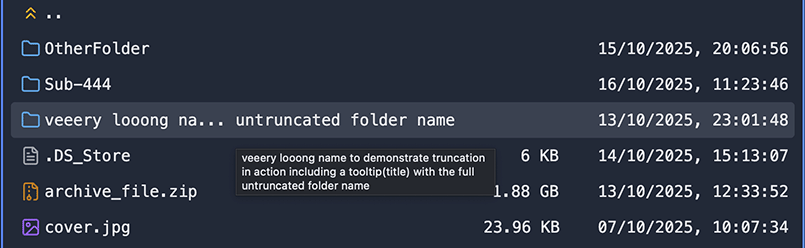
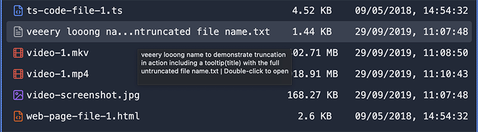

# Dual-Panel File Manager Monorepo [ACTIVE WORK IN PROGRESS - DO NOT USE YET]

This project is a dual-panel file manager inspired by applications like Midnight Commander and Double Commander, built with a React frontend and a Node.js (Express) backend. The project is structured as a monorepo using npm workspaces.

## General Look and Feel


## General Project Structure

```

/                                    # Project root directory
├── packages/                        # Contains the client and server applications
│   ├── client/                      # React frontend application
│   │   ├── screenshots/             # Screnshots used by README.md and Help Modal
│   │   ├── src/                     # Source code for the React application
│   │   │   ├── components/          # Reusable UI components
│   │   │   │   ├── context-menus/   # Components for context menus
│   │   │   │   ├── help-diagrams/   # Components for help diagrams
│   │   │   │   ├── modals/          # Components for modal dialogs
│   │   │   │   ├── panels/          # Components for file panels
│   │   │   │   └── ui/              # General UI components
│   │   │   ├── lib/                 # Utility functions and API clients
│   │   │   ├── state/               # State management for the application
│   │   │   ├── App.jsx              # Main application component
│   │   │   ├── index.css            # Main CSS file
│   │   │   └── main.jsx             # Entry point for the React application
│   │   ├── index.html               # Main HTML file
│   │   ├── postcss.config.js        # PostCSS configuration
│   │   ├── tailwind.config.js       # Tailwind CSS configuration
│   │   └── vite.config.js           # Vite build configuration
│   └── server/                      # Node.js backend application
│       ├── lib/                     # Utility functions and server-side logic
│       ├── routes/                  # API route definitions
│       └── server.js                # Entry point for the Node.js server
├── misc/                            # Miscellaneous scripts and tools
│   ├── create-corrupt-zip.js        # Utility for creating corrupt archives for testing
│   └── README.md                    # Documentation for miscellaneous scripts
└── README.md                        # Main project README

```

## Prerequisites

- **Node.js** (v20.19.0 or later recommended)

- **npm** (v10.8.2 or later recommended)

- **FFmpeg**: This is required for the video preview transcoding feature. It must be installed and accessible in your system's PATH.
  - **macOS (with Homebrew):** `brew install ffmpeg`
  - **Ubuntu/Debian:** `sudo apt install ffmpeg`
  - **Windows:** Download from the [official FFmpeg website](https://ffmpeg.org/download.html) and add the `bin` directory to your system's PATH.

## Getting Started

- Install Dependencies:
  Open your terminal at the root of the project and run the following command. This will install dependencies for the root, the client, and the server all at once.

`npm install`

- Run the Application:
  To start both the backend server and the frontend client in development mode, run this command from the root directory:

`npm run dev`

This command uses concurrently to:

- Start the Node.js server on http://localhost:3001 (with nodemon for auto-restarting).

- Start the React development server on http://localhost:5173.

Your browser should automatically open to the React application.

## How It Works

The React client makes API calls to the Node.js server to get directory listings.

The Node.js server interacts with the local file system to provide the data requested by the client.

A proxy is configured in the Vite settings (packages/client/vite.config.js) to forward requests from /api on the client to the backend server on port 3001. This avoids CORS issues during development.

## Features

- **Dual-Panel Layout**: A dual-panel file manager designed for efficient file operations. The two independent panels allow you to browse two different locations simultaneously, making it easy to move, copy, and compare files and folders between them.

- **File & Folder Listing**: Each panel lists files and folders. Long names are dynamically truncated. Icons next to each name (folder icon for folders, text file icon for text files, image icon for images, etc.) help identify the type.

  
  

- **Panel Usage and Information**: At the bottom of each panel, useful information is displayed. This includes the total disk space and available free space for the current drive/partition, a summary of selected items, and the ability to swap panels. The free space percentage is color-coded to provide a quick visual cue: 🟢 green for more than 25% free, 🟡 yellow for 10-25% free, and 🔴 red for less than 10% free. Hovering over the selected items text reveals a tooltip with a detailed breakdown of selected files and folders, their combined size, and a hint on how to calculate full folder sizes if applicable. You can quickly swap the content of the two panels using <kbd>Cmd/Ctrl + U</kbd>.

  

- **Real-time Folder Monitoring**: The application automatically monitors the directories shown in both panels for any changes made outside of the app. If you create, delete, or rename a file or folder in one of the visible directories using another program (like your operating system's file explorer), the panel will automatically refresh to reflect these changes in real-time.

- **Navigation & Selection**: Navigate using mouse (double-click to enter folder/open file) or keyboard (<kbd>ArrowUp</kbd>/<kbd>Down</kbd>, <kbd>Enter</kbd>, <kbd>Backspace</kbd>, <kbd>Home</kbd>, <kbd>End</kbd>, <kbd>PageUp</kbd>/<kbd>PageDown</kbd>).

  - **Selection**: Click to select. <kbd>Cmd/Ctrl + click</kbd> to add/remove. <kbd>Shift + click</kbd> to select a range.

  - **Select All** (<kbd>Cmd/Ctrl+A</kbd>)

  - **Unselect All** (<kbd>Cmd/Ctrl+D</kbd>)

  - **Invert Selection** (<kbd>\*</kbd>)

  - **Quick Select** (<kbd>+</kbd>): Opens a dialog to select files and folders that match a specific pattern (wildcards or regex).

  - **Quick Unselect** (<kbd>-</kbd>): Opens a dialog to unselect items based on a pattern.

  - **Quick Filter** (<kbd>.</kbd>): Opens an input at the bottom of the panel to filter visible items in real-time. File operations like Copy and Delete will only apply to the filtered items.

    

- **File Preview**: Preview images, videos, PDFs, text files, and zip archives by focusing an item and pressing <kbd>Spacebar</kbd>.

- **Context Menus**: Right-clicking on an item or empty area opens a context menu with relevant actions (Viewing, File Operations, Organization, Folder Tools).

  - **Viewing:** Preview, Open, and Open with...
  - **File Operations:** Contains all major file transfer actions.

    - <kbd>Copy to other panel</kbd>: Performs the Copy (<kbd>F5</kbd>) operation on the selected item(s).
    - <kbd>Move to other panel</kbd>: Performs the Move (<kbd>F6</kbd>) operation on the selected item(s). It is a combination of a complete Copy and Delete operations, in that order.
    - <kbd>Compress</kbd>: Compresses the selected items into a zip archive in the active panel or transfers it to the other panel.
    - <kbd>Decompress Archive</kbd>: Decompresses a selected ZIP archive to the active or other panel, with progress tracking.
    - <kbd>Test Archive</kbd>: Verifies the integrity of a selected ZIP archive, reporting any corrupt files or general issues.
    - <kbd>Copy / Cut (to clipboard)</kbd>: (Coming soon) Standard clipboard operations.

  - **Organization:** Rename and Delete the item.
  - **Folder Tools:** For folders, you can also Calculate Size or set the folder's path in the opposite panel.

- **Calculate Folder Size & Progress**: Calculate the size of a folder (including all its subfolders and and files) from the context menu or by pressing <kbd>Spacebar</kbd> on a focused folder. A progress modal shows the current file being processed, the "Size so far", and the instantaneous transfer speed. During any long-running operation, you can click and hold on the animated icon in the dialog's header to make the dialog semi-transparent (20% opacity), allowing you to see the panels behind. Releasing the mouse button restores full visibility.

- **Path Bar & Breadcrumbs**: Displays the current directory path with clickable "breadcrumbs" for easy navigation. Right-clicking the path bar offers a "Choose folder..." option.

- **Favourites**: The star icon next to the path bar allows you to manage your favourite paths. Add the current path or select a previously saved favourite path. Favourites are remembered across sessions.

- **Top Menus**: "File" and "Select" menus provide access to comprehensive file management and selection tools.

  - **File Menu:** Contains actions related to file operations suchs as Copy, Move, Rename, Delete, Compress, Calculate Size, and Refresh. Many of these actions have corresponding function key shortcuts.
  - **Select Menu:** Offers various ways to manage selections, including Select All, Unselect All, Invert Selection, Quick Select, Quick Unselect, and Quick Filter.

- **Function Key Actions**: The bar at the bottom of the screen shows primary actions mapped to F1-F8 keys for common operations.

  - <kbd>F1</kbd>: Open Help dialog.

  - <kbd>F2</kbd>: Rename the currently focused item.

  - <kbd>F3</kbd>: Preview the focused item if possible (images, text, PDFs, audio, video, zip archives), otherwise open it with its default application.

  - <kbd>F5</kbd>: Copy selected items from the active panel to the other panel.

  - <kbd>F6</kbd>: Move selected items from the active panel to the other panel.

  - <kbd>F7</kbd>: Create a new folder in the active panel.

  - <kbd>F8</kbd>: Delete the selected items.

- **Copy Operation & Conflict Modes**: When copying, if an item exists in the target, a confirmation dialog appears with choices for handling conflicts (e.g., "Yes to All", "Copy if New", "No to All", "Skip if Source is Empty", "Overwrite if Size Differs", "Replace if Smaller").
