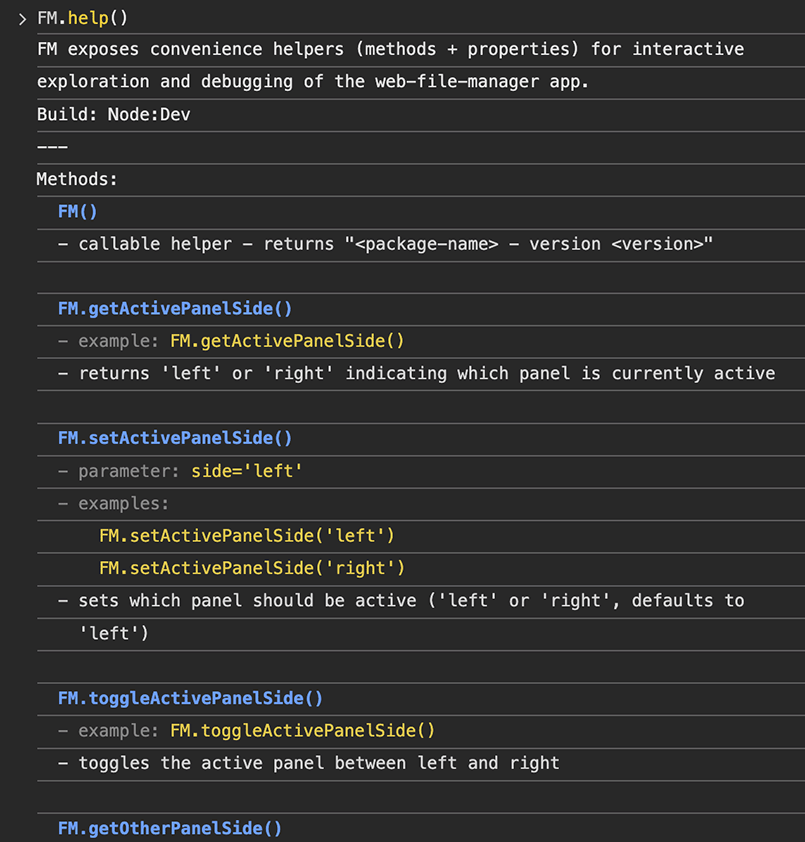

# Miscellaneous helper scripts

This folder contains small helper scripts used during development and local setup. It's also where we keep the utilities used to make the native `node-pty` addon robust across packaging and installs.

## Files

- **prebuild-node-pty.js** — prepares a local Python virtualenv / distutils shim and attempts to build or fetch an ABI-matching `pty.node`. Useful when a host doesn't provide a usable `distutils` or when you want a reproducible local build cache (`.node-pty-cache`). Use the `--apply-fixes`/`--auto-env` flags for conservative automatic help.
- **prepare-node-pty.js** — runtime helper used by the server to restore a cached `pty.node` from `.node-pty-cache` into `packages/server/node_modules/node-pty/build/Release` if present; otherwise it triggers a rebuild and caches the result.
- **patch-node-pty-helperpath.js** — idempotent repo patcher that finds vendor copies of `node-pty` (source and compiled JS/TS copies under `packages/server/node_modules`, `packages/electron/dist`, and the packaged `app.asar.unpacked` tree) and updates the unixTerminal helper path resolution to:

  - deterministically prefer `process.resourcesPath` and `<resources>/app.asar.unpacked` locations,
  - collapse duplicate `.unpacked` segments (defensive normalization),
  - optionally repair naive `app.asar` -> `app.asar.unpacked` string-replace patterns via `--fix-replace-patterns`.

  The patcher is safe to run multiple times (idempotent) and prints a concise summary (`patched` / `checked`). It is integrated into the build pipeline (see `packages/electron/build.js`) and is recommended to run during CI packaging steps.

- **create-corrupt-zip.js** — creates a corrupt zip archive to verify the Archive Integrity feature.

- **fm.js** — exposes developer-friendly global named `FM` in the page context (via `window.FM`) to make debugging and interactive exploration easier when running in dev or Electron contexts. The module acts as an entrypoint and proxy to the modular `misc/fm/` helpers (see below). See the [Console global: FM](#console-global-fm) section for a list of methods and properties.

- **starter.js** — an interactive menu used by `start.*` scripts and the `postinstall` runner.

## PTY Helpers

### Usage & examples

Run the idempotent patcher (recommended during development and CI packaging):

```bash
# quick check (dry-run style — the script prints what it found and whether each file is already patched)
node misc/patch-node-pty-helperpath.js

# run prepack mode (tells the script to also scan packager output and app.asar.unpacked locations)
node misc/patch-node-pty-helperpath.js --prepack

# run with the conservative repair mode to fix naive string-replace patterns introduced by packaging steps
node misc/patch-node-pty-helperpath.js --prepack --fix-replace-patterns
```

Run the prebuild helper if npm install reported problems building `node-pty`:

```bash
node misc/prebuild-node-pty.js --apply-fixes --yes --auto-env
```

Run the runtime preparer (server starts) to attempt to restore a cached `pty.node`:

```bash
node misc/prepare-node-pty.js
```

If you need to gather low-level diagnostics (posix_spawn failures), run the instrumentation helper and enable it when reproducing the failing packaged run (only use for debugging; it's noisy):

```bash
# print extra native spawn tracing to console. Gate this behind an env var in CI or when debugging locally.
NODE_PTY_INSTRUMENT=1 node misc/instrument-node-pty.js --target packages/server
```

### Build and packaging notes

- The repository integrates the patcher into `packages/electron/build.js` so a packaging run will attempt to patch vendor copies before the asar is created. This helps avoid baked-in double `.unpacked` segments.
- The patcher intentionally modifies both source and compiled copies (TS & JS) because many packaging pipelines copy or transpile vendor code. The script is idempotent and logs a summary so CI can assert `patched=0` or a small number of expected edits.

### Safety and rollback

- The patcher is conservative. It writes backups for files it modifies and will not clobber unrelated code. When using `--fix-replace-patterns` the script applies only a small set of conservative pattern repairs that are known to introduce duplicated `.unpacked` segments. If you see an unexpected change, revert the affected file(s) from git.

### CI recommendations

- Add a packaging/verify job that runs:

```bash
# in CI macOS packaging job
node misc/patch-node-pty-helperpath.js --prepack
# package the app (your existing steps)
# then run a small verification script that asserts spawn-helper exists under app.asar.unpacked
```

### Troubleshooting

- If the app's in-app terminal can find utilities when launched from a terminal but not when launched from Finder, it's likely the GUI process lacked the user's shell PATH. The Electron main now includes an experimental PATH sync that attempts to read the login shell and `launchctl` PATH and merge it into `process.env.PATH` at startup.
- If you see `posix_spawn_ret=2` in native logs, run the instrumentation helper to capture the exact argv passed to the native helper and then run the patcher with `--prepack --fix-replace-patterns`.

- If you see an unexpected `misc/packages/server` directory, it's an artifact that can be safely removed: `node misc/cleanup-misc-packages-server.js`. This script will refuse to delete the folder if it detects that it contains the real server files (lib, routes, etc.).

### Summary

The `misc` tools provide a safer, repeatable path for building and packaging the `node-pty` native addon across developer machines and CI. Use the patcher during packaging, keep the prebuild helper in your local toolbox for busted Python/tooling hosts, and only enable the instrumentation when debugging native spawn issues.

## Console global: FM

This project exposes a small, developer-friendly global named `FM` in the page context (via `window.FM`) to make debugging and interactive exploration easier when running in dev or Electron contexts. The global is defined by the `misc/fm.js` module and attached at runtime (client entry + Electron preload). Import it directly from the `misc` folder in files that need it — do not rely on any transient client-local re-export.

### Methods

- `FM()` or `FM.getInfo()` — returns a single string: `"<package-name> - version <version>"`.
- `FM.getName()` — returns package name (eg `web-file-manager`).
- `FM.getVersion()` — returns package version (eg `1.1.7`).
- `FM.getBuildType()` — returns one of: `Node:Dev`, `Electron:Dev`, `Electron:Dist` depending on how the app is running.
- `FM.exit()` — exits/quits the application cleanly. Works for both Node:Dev and Electron builds. Returns a promise that resolves to `{ success: boolean, cancelledJobs?: number, error?: string }`. The method triggers a graceful shutdown that cancels all ongoing jobs (copy, duplicate, compress, decompress, archive tests, size calculations, zip operations, and terminal sessions), closes the server, and exits the process without leaving hanging Node.js processes.
- `FM.getPanels(relativeSelection=true)` — returns an object with both panels: `{ active: { side, path, selection }, other: { side, path, selection } }`. Each panel object contains `side` ('left' or 'right'), `path` (absolute panel path), and `selection` (array of selected items - relative by default, absolute if `false` is passed).
- `FM.getActivePanel(relativeSelection=true)` — returns an object with `{ side, path, selection }` for the active panel. The `side` is `'left'` or `'right'`, `path` is the absolute panel path, and `selection` is an array of selected items (relative by default, absolute if `false` is passed).
- `FM.getOtherPanel(relativeSelection=true)` — returns an object with `{ side, path, selection }` for the other panel. The `side` is `'left'` or `'right'`, `path` is the absolute panel path, and `selection` is an array of selected items (relative by default, absolute if `false` is passed).
- `FM.getActivePanelSide()` — returns `'left'` or `'right'` indicating which panel is currently active.
- `FM.setActivePanelSide(side='left')` — sets which panel should be active. Pass either `'left'` or `'right'` (defaults to `'left'` if omitted).
- `FM.toggleActivePanelSide()` — toggles the active panel between left and right.
- `FM.swapPanels()` — swaps the paths of the left and right panels (exchanges their directory locations).
- `FM.refreshActivePanel()` — refreshes the file list of the active panel.
- `FM.refreshOtherPanel()` — refreshes the file list of the other panel.
- `FM.refreshBothPanels()` — refreshes the file list of both left and right panels.
- `FM.setActivePanelPath(path)` — sets the path of the active panel (async, returns `{success: boolean, error?: string}`). Use `await FM.setActivePanelPath('/path/to/folder')` to navigate the active panel to a specific directory.
- `FM.setOtherPanelPath(path)` — sets the path of the other panel (async, returns `{success: boolean, error?: string}`). Use `await FM.setOtherPanelPath('/path/to/folder')` to navigate the other panel to a specific directory.
- `FM.setActivePanelSelection(items, ignoreCase=false, reset=true)` — sets the selection for the active panel. Pass an array of file/folder names (relative to panel path) or absolute paths. When `ignoreCase` is `true`, performs case-insensitive matching (e.g., 'Info.txt' will match 'info.txt'). When `reset` is `true` (default), clears the current selection before applying the new selection; when `false`, adds to the current selection. Returns `{selected: Array, notFound: Array}` indicating which items were successfully selected and which were not found.
- `FM.setOtherPanelSelection(items, ignoreCase=false, reset=true)` — sets the selection for the other panel. Pass an array of file/folder names (relative to panel path) or absolute paths. When `ignoreCase` is `true`, performs case-insensitive matching (e.g., 'Info.txt' will match 'info.txt'). When `reset` is `true` (default), clears the current selection before applying the new selection; when `false`, adds to the current selection. Returns `{selected: Array, notFound: Array}` indicating which items were successfully selected and which were not found.
- `FM.resetActivePanelSelection()` — clears the selection for the active panel (unselects all items).
- `FM.resetOtherPanelSelection()` — clears the selection for the other panel (unselects all items).
- `FM.resetBothPanelsSelections()` — clears the selection for both panels (unselects all items in both panels).
- `FM.invertActivePanelSelection()` — inverts the selection for the active panel (selects unselected items, unselects selected items).
- `FM.invertOtherPanelSelection()` — inverts the selection for the other panel (selects unselected items, unselects selected items).
- `FM.setActivePanelQuickSelect(pattern, useRegex=false, caseSensitive=false, resetSelection=true)` — performs quick select on the active panel using a pattern (wildcards like `*.jpg` or regex). Returns the count of items selected. When `resetSelection` is `true` (default), clears existing selection before selecting matching items.
- `FM.setOtherPanelQuickSelect(pattern, useRegex=false, caseSensitive=false, resetSelection=true)` — performs quick select on the other panel using a pattern. Returns the count of items selected.
- `FM.setActivePanelQuickUnselect(pattern, useRegex=false, caseSensitive=false, resetSelection=true)` — performs quick unselect on the active panel using a pattern. Returns the count of items unselected. When `resetSelection` is `true` (default), clears all selection before removing matching items.
- `FM.setOtherPanelQuickUnselect(pattern, useRegex=false, caseSensitive=false, resetSelection=true)` — performs quick unselect on the other panel using a pattern. Returns the count of items unselected.
- `FM.setActivePanelQuickFilter(pattern, useRegex=false, caseSensitive=false)` — sets a filter pattern for the active panel to show only matching items (wildcards like `*.jpg` or regex). Returns the count of matching items. Pass an empty string to clear the filter. Special keywords: `_FILES_ONLY_`, `_FOLDERS_ONLY_`, `_ZIP_FILES_ONLY_` filter by item type.
- `FM.setOtherPanelQuickFilter(pattern, useRegex=false, caseSensitive=false)` — sets a filter pattern for the other panel to show only matching items. Returns the count of matching items. Pass an empty string to clear the filter. Special keywords: `_FILES_ONLY_`, `_FOLDERS_ONLY_`, `_ZIP_FILES_ONLY_` filter by item type.
- `FM.setActivePanelQuickFilterFiles()` — filters the active panel to show only files. Returns the count of files. Use special keyword `_FILES_ONLY_` in Quick Filter modal for the same effect.
- `FM.setOtherPanelQuickFilterFiles()` — filters the other panel to show only files. Returns the count of files.
- `FM.setActivePanelQuickFilterFolders()` — filters the active panel to show only folders. Returns the count of folders. Use special keyword `_FOLDERS_ONLY_` in Quick Filter modal for the same effect.
- `FM.setOtherPanelQuickFilterFolders()` — filters the other panel to show only folders. Returns the count of folders.
- `FM.setActivePanelQuickFilterZipFiles()` — filters the active panel to show only zip/archive files. Returns the count of zip files. Use special keyword `_ZIP_FILES_ONLY_` in Quick Filter modal for the same effect.
- `FM.setOtherPanelQuickFilterZipFiles()` — filters the other panel to show only zip/archive files. Returns the count of zip files.
- `FM.resetActivePanelQuickFilter()` — clears the filter for the active panel (shows all items). Returns the count of items in the panel.
- `FM.resetOtherPanelQuickFilter()` — clears the filter for the other panel (shows all items). Returns the count of items in the panel.
- `FM.resetBothPanelQuickFilter()` — clears the filter for both panels (shows all items). Returns the combined count of items in both panels.
- `FM.selectActivePanelFiles()` — selects only files (non-folder, non-parent items) in the active panel. Returns the count of files selected.
- `FM.selectOtherPanelFiles()` — selects only files (non-folder, non-parent items) in the other panel. Returns the count of files selected.
- `FM.selectActivePanelFolders()` — selects only folders in the active panel. Returns the count of folders selected.
- `FM.selectOtherPanelFolders()` — selects only folders in the other panel. Returns the count of folders selected.
- `FM.selectActivePanelZipFiles()` — selects only zip/archive files in the active panel. Returns the count of zip files selected.
- `FM.selectOtherPanelZipFiles()` — selects only zip/archive files in the other panel. Returns the count of zip files selected.
- `FM.unselectActivePanelFiles()` — unselects only files in the active panel. Returns the count of items remaining in the selection.
- `FM.unselectOtherPanelFiles()` — unselects only files in the other panel. Returns the count of items remaining in the selection.
- `FM.unselectActivePanelFolders()` — unselects only folders in the active panel. Returns the count of items remaining in the selection.
- `FM.unselectOtherPanelFolders()` — unselects only folders in the other panel. Returns the count of items remaining in the selection.
- `FM.unselectActivePanelZipFiles()` — unselects only zip/archive files in the active panel. Returns the count of items remaining in the selection.
- `FM.unselectOtherPanelZipFiles()` — unselects only zip/archive files in the other panel. Returns the count of items remaining in the selection.
- `FM.getOtherPanelSide()` — returns `'left'` or `'right'` indicating which panel is currently other/inactive.
- `FM.getActivePanelPath()` — returns the absolute path (string) of the currently active panel.
- `FM.getOtherPanelPath()` — returns the absolute path (string) of the currently other/inactive panel.
- `FM.getActivePanelSelection(relative=true)` — returns an array of paths for selected items in the active panel. By default returns relative paths (relative to the panel path). Pass `false` to get absolute paths.
- `FM.getOtherPanelSelection(relative=true)` — returns an array of paths for selected items in the other panel. By default returns relative paths (relative to the panel path). Pass `false` to get absolute paths.
- `FM.help()` — prints a short intro, current build type, and lists all available FM methods and properties (one-per-line). Useful for interactive console discovery.`FM.help()` prints the help to the console by default and DOES NOT return the help string (this avoids the console echoing the return value). If you need the help text as a string, call `FM.help(true)` or `FM.help({ returnOutput: true })`.

### Properties

- `FM.name` (readonly) — value same as `FM.getName()`.
- `FM.version` (readonly) — value same as `FM.getVersion()`.
- `FM.buildType` (readonly) — value same as `FM.getBuildType()`.

### Supporting FM modules

- `attach.js` — attaches the `FM` object to the global scope (`window`/`globalThis`) and prints a one-time hint about `FM` being available.
- `help.js` — constructs and prints the `FM.help()` output using the metadata file.
- `methods.js` — implements the FM helper functions (e.g., navigation, selection, quick select/filter, refresh, etc.).
- `properties.js` — attaches read-only properties to the `FM` object (name, version, buildType) and exposes the `_meta` metadata object.
- `utils.js` — internal helper functions used by the FM modules (detectBuildType, getAppState, buildSelection).
- `meta.json` — JSON metadata for methods and properties used by `help.js` and `properties.js`.

### Notes:

- `FM` is exported as a function so that calling `FM()` returns the information string while still allowing properties and helper functions to be attached to the same object (function objects in JS are valid namespaces).
- On Electron, `FM` is injected into the page context from the preload script for visibility in DevTools. When running in packaged builds, `FM.getBuildType()` will return `Electron:Dist` (packaged apps typically load content via the `file://` protocol). The Electron `preload` script also attempts to inject and attach `FM` into the page's context so that `FM` and `FM.help()` are available in DevTools for both dev and packaged builds. If the injection is not possible (e.g., the file is bundled differently in your packaging), the client `attachFMToWindow()` call remains the fallback.

